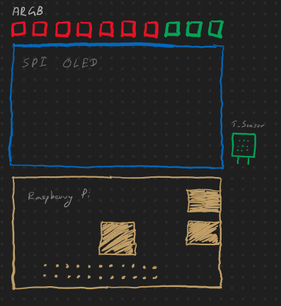

# itx_on_screen_display
OSD for a mini itx desktop using raspberry pi

## Purpose
The purpose of this project is to build a on screen display that can be mounted to a mini itx pc. 

## Features
* Addressable RGB strip 
  - Will be used to display temperature, humidity inside the case
* SPI OLED display
  - Used to display various stats 
  - Temperature (Gathered using a temperature sensor connected to raspberry pi
  - CPU, Mem, AIO temps gathered using a collectd service running on the pi
  - CPU, Mem usage gathered using a collectd service running on the pi

## Tech Stack
* Debian Buster armv7l
